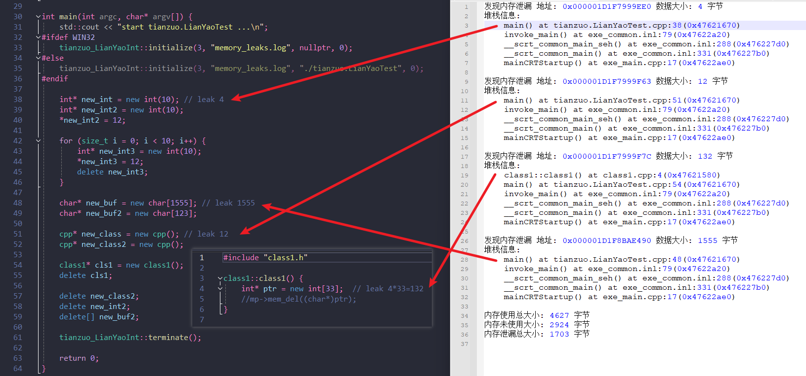

<h4 align="right">简体中文 | <strong><a href="README_en.md">English</a></strong></h4>


### 天佐.炼妖壶


||||
|--|--|--|
|操作系统|  ||
|编译器|       ||
|编程语言|  ||
# 简介


**天佐.炼妖壶** 一种简单的内存池，初始化申请一些内存循环使用，不够时动态进行扩容，并且带内存泄漏检测功能。

**传说:**
它代表着融合和进化。炼妖壶可以收纳万物，将妖兽、灵兽等生物炼化为壶中元气。这种力量象征着融合与进化，寓意着道家文化的包容与和谐。

# 目标
设计一种内存池，循环进行内存使用，提高内存使用效率，同时提供内存泄漏检测功能。


# 功能

- 🧩 集成简单
- 📝 可选择生成内存泄漏日志
- 🪐 日志多语言(简体中文/English)

# 截图

**通过日志分析定位内存泄漏代码行:**



# 例子

```cpp

#include <iostream>
#include "../../include/tianzuo.LianYaoInterface.h"

void* operator new(size_t size) {
    return tianzuo_LianYaoInt::mem_get(size);
}
void* operator new[](size_t size) {
    return operator new(size);
}

void operator delete(void* ptr) noexcept {
    tianzuo_LianYaoInt::mem_del(ptr);
}
void operator delete[](void* ptr) noexcept {
    operator delete(ptr);
}

class cpp {
 public:
    cpp() {}
    ~cpp() {}
 private:
     int m_a;
     long m_l;
     float m_f;
};

int main(int argc, char* argv[]) {
    std::cout << "start tianzuo.LianYaoTest ...\n";
#ifdef WIN32
    tianzuo_LianYaoInt::initialize(3, "memory_leaks.log", nullptr, 0);
#else
    tianzuo_LianYaoInt::initialize(3, "memory_leaks.log", "./tianzuo.LianYaoTest", 0);
#endif

    int* new_int = new int(10); // leak 4
    int* new_int2 = new int(10);
    *new_int2 = 12;
    
    for (size_t i = 0; i < 10; i++) {
        int* new_int3 = new int(10);
        *new_int3 = 12;
        delete new_int3;
    }
   
    char* new_buf = new char[1555]; // leak 1555
    char* new_buf2 = new char[123];

    cpp* new_class = new cpp(); // leak 12
    cpp* new_class2 = new cpp();
    
    class1* cls1 = new class1();
    delete cls1;

    delete new_class2;
    delete new_int2;
    delete[] new_buf2;

    tianzuo_LianYaoInt::terminate();

    return 0;
}

```

# 下载

|||||
|--|--|--|--|
|[](https://github.com/zhengtianzuo/tianzuo.LianYao/releases)|[](https://gitee.com/zhengtianzuo/tianzuo.LianYao/releases)|[](https://pan.baidu.com/s/1Lv9dOBpV4-eXpi9yl0BSUg?pwd=1234)|[](https://share.weiyun.com/ReeeXXwu)|


# 关于
## 联系方式

||||
|--|--|--|
|作者|郑天佐||
|QQ|278969898||
|邮箱|camelsoft@163.com||
|主页|[http://www.camelstudio.cn](http://www.camelstudio.cn)||
|博客|[http://blog.csdn.net/zhengtianzuo06](http://blog.csdn.net/zhengtianzuo06)||
|github|[https://github.com/zhengtianzuo](https://github.com/zhengtianzuo)||
|gitee|[https://gitee.com/zhengtianzuo](https://gitee.com/zhengtianzuo)||
|QQ群|199672080||


|||||
|--|--|--|--|
|加QQ好友|加微信好友|微信打赏|支付宝打赏|


