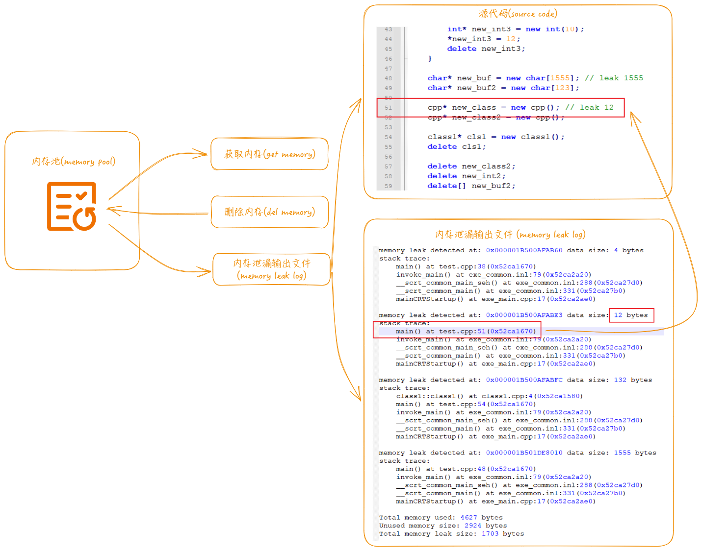

<h4 align="right"><strong><a href="README.md">简体中文</a></strong> | English</h4>


### tianzuo.LianYao


||||
|--|--|--|
|operating system|  ||
|compiler|       ||
|programming language| ||
# introduction


**tianzuo.LianYao** A simple memory pool that initializes some memory for recycling, dynamically expands when insufficient, and has memory leak detection function.

**legend:**
It represents fusion and evolution. The demon pot can contain all things, and refine the demon beasts and spirit beasts into the vitality of the pot. This power symbolizes integration and evolution, and implies the tolerance and harmony of Taoist culture.

# motivation
A memory pool is designed to use memory in cycles, improve memory usage efficiency, and provide memory leak detection function.



# features

- 🧩 simple integration
- 📝 optionally generate memory leak log
- 🪐 log in multiple languages (simplified chinese / english)

# screenshot

**locate memory leak lines of code through log file analysis:**


# example

```cpp

#include <iostream>
#include "../../include/tianzuo.LianYaoInterface.h"

void* operator new(size_t size) {
    return tianzuo_LianYaoInt::mem_get(size);
}
void* operator new[](size_t size) {
    return operator new(size);
}

void operator delete(void* ptr) noexcept {
    tianzuo_LianYaoInt::mem_del(ptr);
}
void operator delete[](void* ptr) noexcept {
    operator delete(ptr);
}

class cpp {
 public:
    cpp() {}
    ~cpp() {}
 private:
     int m_a;
     long m_l;
     float m_f;
};

int main(int argc, char* argv[]) {
    std::cout << "start tianzuo.LianYaoTest ...\n";
#ifdef WIN32
    tianzuo_LianYaoInt::initialize(3, "memory_leaks.log", nullptr, 0);
#else
    tianzuo_LianYaoInt::initialize(3, "memory_leaks.log", "./tianzuo.LianYaoTest", 0);
#endif

    int* new_int = new int(10); // leak 4
    int* new_int2 = new int(10);
    *new_int2 = 12;
    
    for (size_t i = 0; i < 10; i++) {
        int* new_int3 = new int(10);
        *new_int3 = 12;
        delete new_int3;
    }
   
    char* new_buf = new char[1555]; // leak 1555
    char* new_buf2 = new char[123];

    cpp* new_class = new cpp(); // leak 12
    cpp* new_class2 = new cpp();
    
    class1* cls1 = new class1();
    delete cls1;

    delete new_class2;
    delete new_int2;
    delete[] new_buf2;

    tianzuo_LianYaoInt::terminate();

    return 0;
}

```

# download

|||||
|--|--|--|--|
|[](https://github.com/zhengtianzuo/tianzuo.LianYao/releases)|[](https://gitee.com/zhengtianzuo/tianzuo.LianYao/releases)|[](https://pan.baidu.com/s/1Lv9dOBpV4-eXpi9yl0BSUg?pwd=1234)|[](https://share.weiyun.com/ReeeXXwu)|

# about
## contact

||||
|--|--|--|
|author|zhengtianzuo||
|QQ|278969898||
|mailbox|camelsoft@163.com||
|homepage|[http://www.camelstudio.cn](http://www.camelstudio.cn)||
|blog|[http://blog.csdn.net/zhengtianzuo06](http://blog.csdn.net/zhengtianzuo06)||
|github|[https://github.com/zhengtianzuo](https://github.com/zhengtianzuo)||
|gitee|[https://gitee.com/zhengtianzuo](https://gitee.com/zhengtianzuo)||
|QQ group|199672080||


|||||
|--|--|--|--|
|Add QQ Friends|Add WeChat Friends|WeChat Sponsor|Alipay Sponsor|


